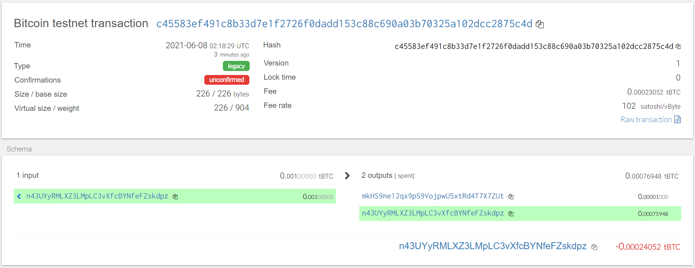
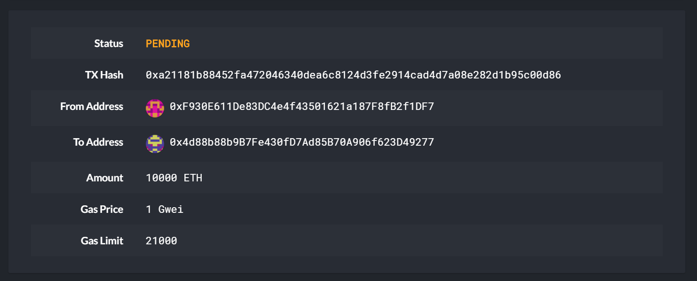

# Python-based Multi-Blockchain Wallet

## Background
This wallet has been created through Python and is meant to hold and transact with multiple cryptocurrencies. At the time of publishing, this wallet is capable of holding and transacting with Ethereum and the BTC Testnet.

## Dependencies

The following dependencies are required in order to use this wallet: 

> **Important:** If you have _not_ already installed the dependencies listed below, you may do so by following the instructions found in the following guides:
  > - [HD Wallet Derive Installation Guide](https://nu.bootcampcontent.com/NU-Coding-Bootcamp/nu-chi-fin-pt-01-2021-u-c/blob/master/19-Blockchain-Python/HW%20Instructions/Resources/HD_Wallet_Derive_Install_Guide.md) 
  > - [Blockchain TX Installation Guide](https://nu.bootcampcontent.com/NU-Coding-Bootcamp/nu-chi-fin-pt-01-2021-u-c/blob/master/19-Blockchain-Python/HW%20Instructions/Resources/Blockchain_TX_Install_Guide.md).

**Dependencies List:**
- PHP must be installed on your operating system.

- You will need to clone the [`hd-wallet-derive`](https://github.com/dan-da/hd-wallet-derive) tool.

- [`bit`](https://ofek.github.io/bit/) Python Bitcoin library.

- [`web3.py`](https://github.com/ethereum/web3.py) Python Ethereum library.

## Instructions
____

- Open up a terminal window inside of `wallet.py`
- Then run the command `python` to open the Python shell. 
- Within the Python shell, run the command `from wallet import *`. This will allow you to access the functions in `wallet.py` interactively.
- You'll need to set the account with  `priv_key_to_account` and use `send_tx` to send transactions.

  - **Bitcoin Testnet transaction**

    - Fund a `BTCTEST` address using [this testnet faucet](https://testnet-faucet.mempool.co/).

    - Use a [block explorer](https://tbtc.bitaps.com/) to watch transactions on the address.

    - Send a transaction to another testnet address (either one of your own, or the faucet's).
        - Example: 
        ```
        send_tx(BTCTEST, priv_key_to_account(BTCTEST, "cUvaDdZTXe1oTRhhXSeGStHFLavXw7cisyky2NsuVCHrnYaTDV6Q"), "mkHS9ne12qx9pS9VojpwU5xtRd4T7X7ZUt",  .00001)
    - You should see a confirmation screen such as the one below:

      


  - **Local PoA Ethereum transaction**

    - Add one of the `ETH` addresses to the pre-allocated accounts in your `networkname.json`.

    - Delete the `geth` folder in each node, then re-initialize using `geth --datadir nodeX init networkname.json`.
      This will create a new chain, and will pre-fund the new account.

    - [Add the following middleware](https://web3py.readthedocs.io/en/stable/middleware.html#geth-style-proof-of-authority)
      to `web3.py` to support the PoA algorithm:

      ```
      from web3.middleware import geth_poa_middleware

      w3.middleware_onion.inject(geth_poa_middleware, layer=0)
      ```

    - Due to a bug in `web3.py`, you will need to send a transaction or two with MyCrypto first, since the
      `w3.eth.generateGasPrice()` function does not work with an empty chain. You can use one of the `ETH` address `privkey`,
      or one of the `node` keystore files.

    - Send a transaction from the pre-funded address within the wallet to another
        - Example:
        ```
        send_tx(ETH, priv_key_to_account(ETH, 0xc819900e562bdd42185c685ad46ed269be4d2febb65895dfd04668543c5de2fa), "0x4d88b88b9B7Fe430fD7Ad85B70A906f623D49277", 10000)

    - Copy the `txid` into MyCrypto's TX Status, afterwhich you will see a confirmation screen such as this one:

      
